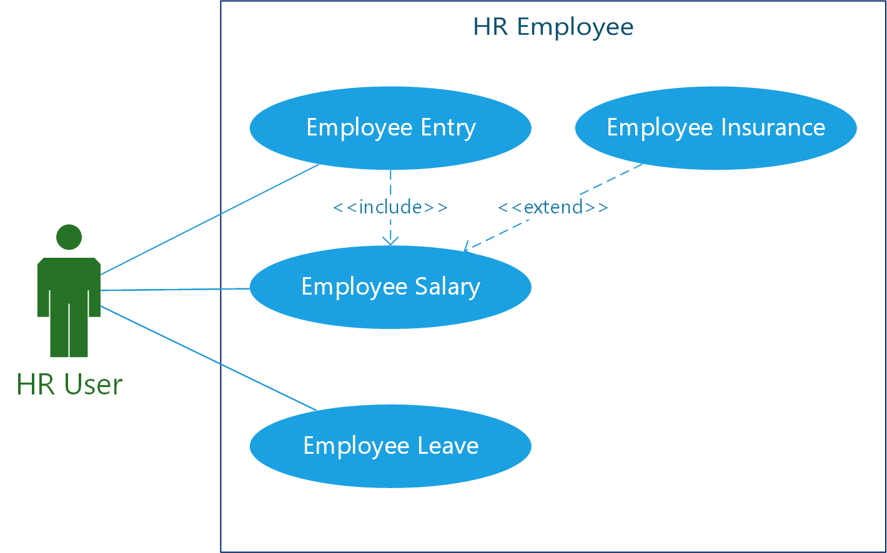
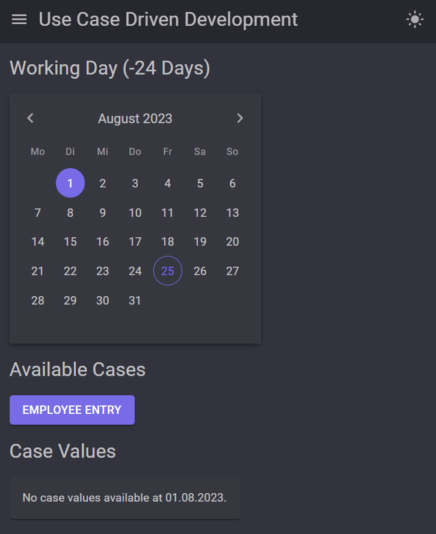
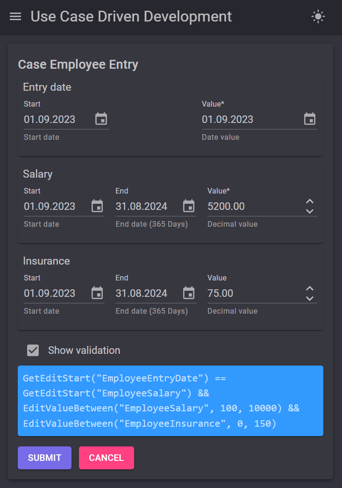
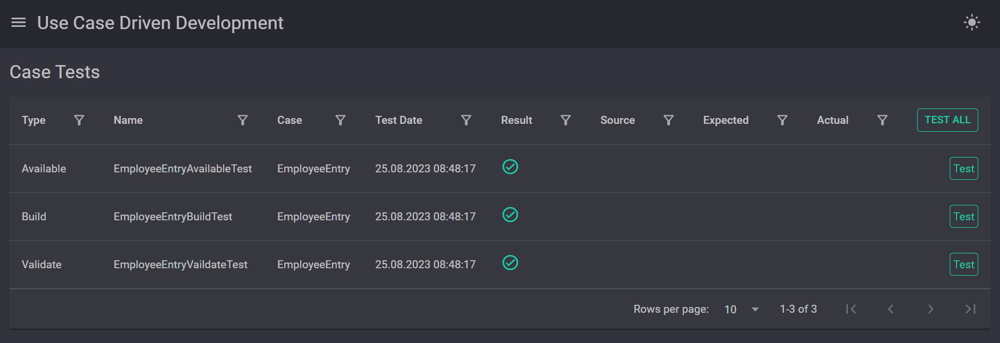
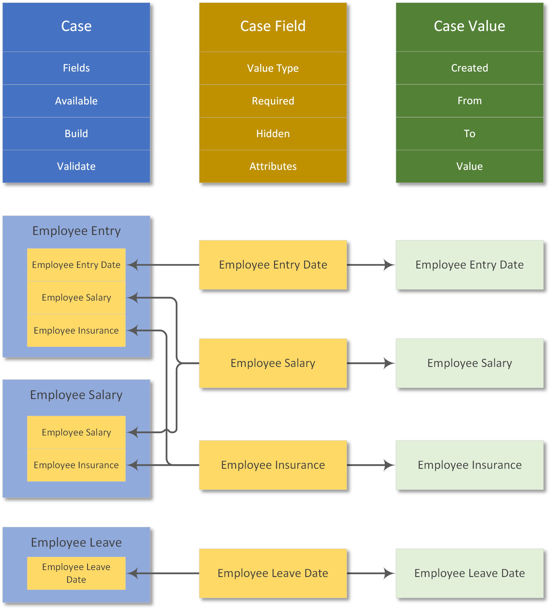
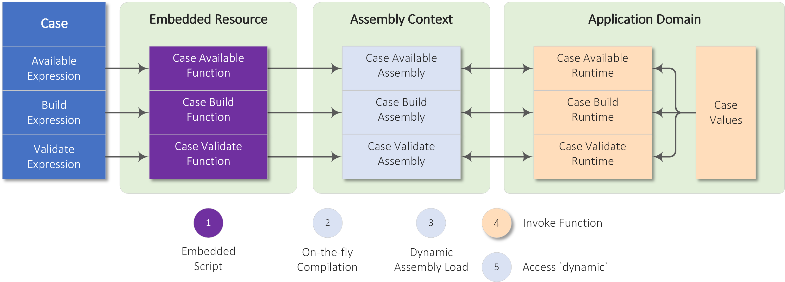
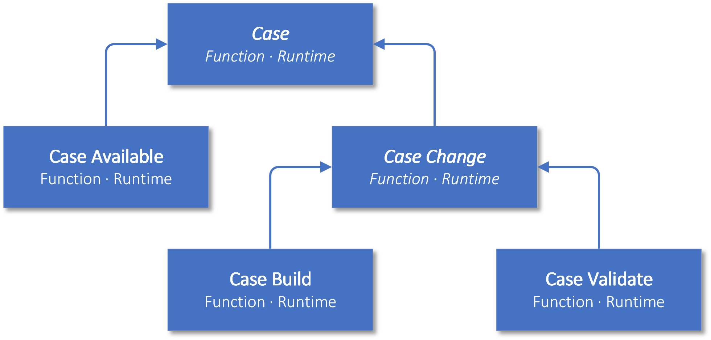
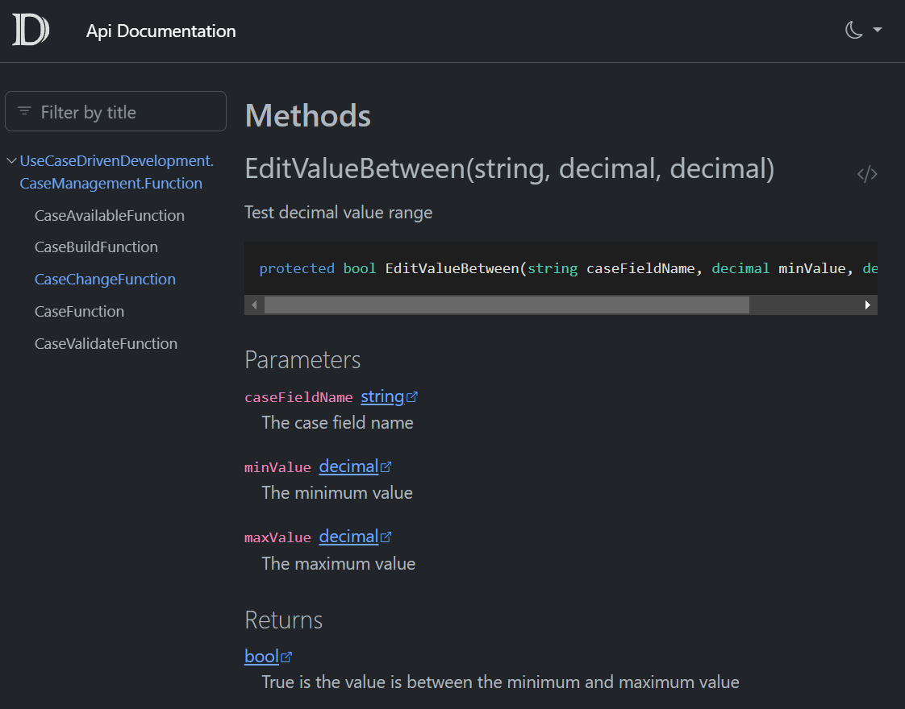

# Use Case Driven Development with Low-Code

Gathering user requirements using use cases is a proven technique that Alistair Cockburn described in detail in his book [Writing Effective Use Cases](https://books.google.ch/books?id=p-anAgAAQBAJ&hl=de&source=gbs_book_other_versions) back in 2000. The use cases are developed during requirements engineering with the users and serve as a guide for the development of the solution. In practice, knowledge transfer from business to engineering is often difficult because of the different ways in which people work.

New technologies make it possible to build software solutions that can be created by technically skilled users themselves. The following requirements must be met:
- The data model can be defined through configuration.
- The available business cases with input and processing rules are described by scripts.
- The business rules are checked on input (client side) and on the backend transfer (server side).
- The model and its runtime behavior can be automatically tested.
- The technical implementation is documented.

The following approach describes `low-code` solution development driven by use cases. The development requirements are
- `JSON` - Knowledge of JSON to define the static structures.
- `C#` - Basic knowledge of C# at the Excel function level to define the dynamic runtime behavior.

## Business Case Example
To illustrate, let's take the use case of hiring an employee from HR software:
<p align="center">
    
</p>

The following business rules were defined during requirements engineering:
- New employees must be entered using the `Employee Entry` use case, after which the remaining use cases are available.
- The entry date and salary must be defined when the employee joins the company.
- The salary can be changed later using the `Employee Salary` use case.
- Employees have a minimum salary of `100` and a maximum salary of `10000`.
- For a salary above `5000`, the insurance amount can be set from `0` to `150` using the `Employee Insurance` use case.
- The `Employee Leave` use case terminates the employment relationship on the leave date. After that, only the `Employee Entry` use case is available for re-entry.


## Web Application
Cases are managed in the web application through the following pages
- `Cases` - input of case data
- `Case Values` - overview of the entered case values with the possibility to delete all data
- `Case Tests` - execution of [case tests](#test-configuration)

The Blazor Server application uses the open source component [MudBlazor](https://github.com/MudBlazor/MudBlazor/), which I recommend to C# oriented developers. To keep the application simple, all data is stored in JSON [files](#case-configuration).

The timeline is controlled by selecting the `working day` that represents the evaluation date. The available cases and case data are displayed from the time of the working day. This setting is used to simulate past and future input. In normal operation, this is the current day.
<p align="center">
    
</p>

When you start the use case `Employee Entry`, you see a unified input mask that dynamically populates input fields based on the case definition:
<p align="center">
    
</p>

When capturing the cases, the dynamic behavior is of interest:
- Only the cases according to the `Available` expression are available.
- If the start date of the entry-date field changes, this is transferred to the value (`Build` expression).
- The input of the salary is limited to the range `100-10000`.
- If the salary is greater than `5000`, the additional field for insurance appears.
- The insurance value is limited to the range `0-150`.

After executing the `Employee Entry` use case, the workday data is displayed. The `Case Values` page displays all existing time values.

The `Case Tests` page allows you to run custom tests:
<p align="center">
    
</p>

### Case Model
The business data is described by three objects:
- `Case` - Case with fields and the script expressions for availability (`Available`), build (`Build`), and server-side validation (`Validate`).
- `Case Field` - Case field with data type and basic properties such as `Required`, `Hiiden` and for client-side validation the `Attributes`. A field can be shared by multiple cases.
- `Case Value` - The value of a field, including the validity period of the value. Read more about [Time Data](https://github.com/Giannoudis/TravelThroughTimeData).


The case model for the employee hiring use cases:
<p align="center">
    
</p>

## Case Configuration
The configuration of cases is done in JSON files in the `WebApp\Data` folder and is divided into case fields and cases.

The first step is to define the case fields.
```json
[
  {
    "name": "EmployeeEntryDate",
    "label": "Entry date",
    "valueType": "DateTime",
    "required": true,
    "moment": true
  },
  {
    "name": "EmployeeLeaveDate",
    "label": "Leave date",
    "ValueType": "DateTime",
    "required": true,
    "moment": true
  },
  {
    "name": "EmployeeSalary",
    "label": "Salary",
    "valueType": "Decimal",
    "required": true,
    "attributes": {
      "minValue": "100",
      "maxValue": "10000"
    }
  },
  {
    "name": "EmployeeInsurance",
    "label": "Insurance",
    "valueType": "Decimal",
    "hidden": true,
    "attributes": {
      "minValue": "0",
      "maxValue": "150"
    }
  }
]
```

The fields for the entry date `EmployeeEntryDate` and the leave date `EmployeeLeaveDate` are instant values (`Moment`) and cannot be constrained in time. For client-side validation, the constraints are defined in the `Attribute` dictionary.

The next step is to compose the cases with the fields and the C# expressions for the runtime behavior:
```json
[
  {
    "name": "EmployeeEntry",
    "label": "Employee Entry",
    "availableExpression": "!HasCaseValue(\"EmployeeEntryDate\") || 
        GetCaseDateTimeValue(\"EmployeeLeaveDate\") > GetCaseDateTimeValue(\"EmployeeEntryDate\")",
    "buildExpression": "SetEditValueStart(\"EmployeeEntryDate\"); 
        SetVisibility(\"EmployeeInsurance\", GetDecimalValue(\"EmployeeSalary\") >= 5000);",
    "validateExpression": "GetEditStart(\"EmployeeEntryDate\") == GetEditStart(\"EmployeeSalary\") && 
        EditValueBetween(\"EmployeeSalary\", 100, 10000) && EditValueBetween(\"EmployeeInsurance\", 0, 150)",
    "fields": [
      "EmployeeEntryDate",
      "EmployeeSalary",
      "EmployeeInsurance"
    ]
  },
  {
    "name": "EmployeeSalary",
    "label": "Employee Salary",
    "availableExpression": "HasCaseValue(\"EmployeeEntryDate\") && 
        GetCaseDateTimeValue(\"EmployeeEntryDate\") > GetCaseDateTimeValue(\"EmployeeLeaveDate\", DateTime.MinValue)",
    "buildExpression": "SetVisibility(\"EmployeeInsurance\", GetDecimalValue(\"EmployeeSalary\") >= 5000);",
    "validateExpression": "EditValueBetween(\"EmployeeSalary\", 100, 10000) &&
        EditValueBetween(\"EmployeeInsurance\", 0, 150)",
    "fields": [
      "EmployeeSalary",
      "EmployeeInsurance"
    ]
  },
  {
    "name": "EmployeeLeave",
    "label": "Employee Leave",
    "availableExpression": "HasCaseValue(\"EmployeeEntryDate\") && 
        GetCaseDateTimeValue(\"EmployeeEntryDate\") > GetCaseDateTimeValue(\"EmployeeLeaveDate\", DateTime.MinValue)",
    "buildExpression": "SetEditValueStart(\"EmployeeLeaveDate\")",
    "fields": [
      "EmployeeLeaveDate"
    ]
  }
]
```

| Case | Expression | Description |
|:---|:---|:---|
| `EmployeeEntry`  | Available | No employee entry or previous exit |
|                  | Build     | Synchronize entry date with the start date |
|                  | Validate  | Check valid entry date and salary limits |
| `EmployeeSalary` | Available | Employee is employed |
|                  | Build     | Show or hide the insurance value depending on the salary limit amount |
|                  | Validate  | Check limits for salary and insurance |
| `EmployeeLeave`  | Available | Employee is employed |
|                  | Build     | Synchronize leaving date with the start date |

## Test Configuration
The configuration of the tests is also done in JSON files in the `WebApp\Tests` folder, divided into `Available`, `Build`, and `Validate`.

The following example describes the validation test for the `Employee Entry` use case:
```json
[
  {
    "name": "EmployeeEntryVaildateTest",
    "caseName": "EmployeeEntry",
    "expectedValid": true,
    "caseValues": [
      {
        "field": "EmployeeEntryDate",
        "period": {
          "start": "2023-09-01T00:00:00.0Z"
        },
        "value": "\u00222023-09-01T00:00:00.0Z\u0022"
      },
      {
        "field": "EmployeeSalary",
        "period": {
          "start": "2023-09-01T00:00:00.0Z"
        },
        "value": "3500"
      }
    ]
  }
]
```
With `caseValues` all input values are simulated and a valid validation result `expectedValid` is expected. Other tests show how to test for changes in case fields (`expectedCaseFields`) and case values (`expectedCaseValues`).

## Behind the scenes
At runtime, the Case C# expressions are embedded into a function and dynamically compiled into an assembly using the [Roslyn](https://github.com/dotnet/roslyn) C# compiler. Then the function that contains the expression is called (e.g. `CaseAvailableFunction.Availablle()`). At runtime, the function provides various methods to access stored case values as well as the current input data.

<p align="center">
    
</p>

### Case Classes
The cases with the functions and runtime have the following class hierarchy:
<p align="center">
    
</p>

### Case Functions
Function classes are embedded resources in which the expression is embedded. C# classes can be used in .NET for compilation and as an embedded resource at the same time. This requires the following manual changes to the `CaseManagement.csproj` project file.
```xml
<ItemGroup>
	<EmbeddedResource Include="Function\CaseFunction.cs">
		<LogicalName>Function\CaseFunction.cs</LogicalName>
	</EmbeddedResource>
	<EmbeddedResource Include="Function\CaseChangeFunction.cs">
	  <LogicalName>Function\CaseChangeFunction.cs</LogicalName>
	</EmbeddedResource>
	<EmbeddedResource Include="Function\CaseAvailableFunction.cs">
		<LogicalName>Function\CaseAvailableFunction.cs</LogicalName>
	</EmbeddedResource>
	<EmbeddedResource Include="Function\CaseBuildFunction.cs">
		<LogicalName>Function\CaseBuildFunction.cs</LogicalName>
	</EmbeddedResource>
	<EmbeddedResource Include="Function\CaseValidateFunction.cs">
		<LogicalName>Function\CaseValidateFunction.cs</LogicalName>
	</EmbeddedResource>
</ItemGroup>
```

The base class `CaseFunction` contains methods that pass `dynamic` calls to the runtime.
```csharp
public abstract class CaseFunction
{
    /// <summary>The function runtime</summary>
    protected dynamic Runtime { get; }

    protected CaseFunction(object runtime)
    {
        Runtime = runtime ?? throw new ArgumentNullException(nameof(runtime));
    }

    /// <summary>Test for case value</summary>
    protected bool HasCaseValue(string caseFieldName, DateTime? evaluationDate = null) =>
        Runtime.HasCaseValue(caseFieldName, evaluationDate);

    ...
}
```

### Case Runtimes
The request is processed in the `CaseRuntime` runtime class.
```csharp
public abstract class CaseRuntime
{
    private readonly CaseValueService valueService = new();
    protected CaseRuntimeContext Context { get; }

    protected CaseRuntime(CaseRuntimeContext context)
    {
        Context = context ?? throw new ArgumentNullException(nameof(context));
    }

    /// <summary>Test for case value</summary>
    public bool HasCaseValue(string caseFieldName, DateTime? evaluationDate = null) =>
        valueService.GetCaseValue(caseFieldName, evaluationDate ?? Context.EvaluationDate) != null;

   ....
}
```

## Low-Code Documentation
Tools like [DocFx](https://github.com/dotnet/docfx) provide the ability to display the programmable functions in HTML pages. They are used with the following commands in the `docfx` folder:
- `Static.Build.cmd` - builds static HTML documentation
- `Static.Start.cmd` - starts the static HTML documentation (requires the build command)
- `Server.Start.cmd` - starts the DocFx application running on the local host `http://localhost:5865/` (dark mode support).

The HTML help file contains a description of all low-code classes:
<p align="center">
    
</p>

## Extension Levels
Based on this concept, I implemented several features, some of which I will describe in future articles.

| Feature | Description |
|:---|:---|
| No-Code Development | The dynamic composition of the function can include predefined `Actions`, such as the format of a social security number. Actions are configured from a list. |
| Case Relation | For more complex case compositions, the relationship between cases can be mapped in a `Case Relation`. This has a `Build` and `Validate` specification analogous to the `Case`. |
| List Values | With `Case Slots`, multiple values can be mapped to a field in an array. The value access is not indexed, but accessed by the slot name. |
| Assembly Cache | For performance critical applications, the function assembly can be cached. |
